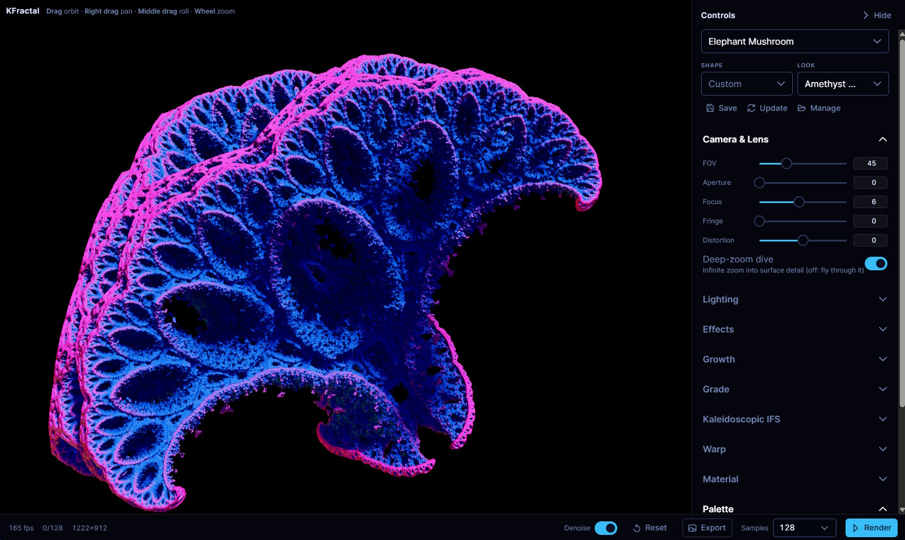

# KFractal

**A browser-based workstation for creating cinematic 3D fractal images.**

KFractal is a WebGPU progressive path tracer for authoring fractal art. Orbit a fractal in a
sharp, interactive preview; hit **Render**, and the image refines itself sample-by-sample into
a path-traced still — deep ambient occlusion, soft contact shadows, glossy highlights, and
orbit-trap color that bounces through the light transport. Start from a curated preset, then
drill into every parameter and save your own.

[](https://github.com/jazzonaut/KFractal/actions/workflows/ci.yml)
[](./LICENSE)

**▶ [Try it live](https://jazzonaut.github.io/kfractal)** — runs entirely in your browser, no install.

> ⚠️ **Requires WebGPU.** KFractal runs only in a WebGPU-capable browser — a recent build of
> Chrome or Edge (desktop or mobile). There is no WebGL fallback.



---

## Features

- **Dual-mode rendering** — a cheap analytic **preview** (AO + soft shadow + glossy spec) while
  you interact, and a progressive multi-bounce **path tracer** that accumulates when the view
  is idle. Any input resets to the preview; an explicit Render action starts converging.
- **Seven distance-estimator formulas** — Mandelbox, Mandelbulb, Apollonian, Menger Sponge,
  Kaleidoscopic IFS, Quaternion Julia, and Pseudo-Kleinian. Each is raw WGSL plus a parameter
  schema that drives the controls automatically.
- **Shape × Look authoring** — geometry (formula, framing, march quality, orbit-trap mapping)
  and art direction (lights, sky, material, palette, effects, lens) are independent axes you
  mix freely. 12 curated shapes × 9 curated looks → 13 curated presets out of the box.
- **Shape generator** — randomize or mutate shapes over each formula's parameter schema, with
  per-parameter locks, formula pinning, and adjustable variation strength.
- **Up to 4 lights per look** — directional (soft sun at infinity) or positional (invisible
  scene sphere lights with inverse-square falloff), with next-event estimation and MIS.
- **Procedural environments** — studio fill, Preetham daylight sky, or importance-sampled
  procedural env maps. Every environment is generated — KFractal never mixes fractal graphics
  with real-world imagery.
- **Orbit-trap color** — a weighted multi-stop gradient indexed by an orbit trap becomes the
  surface albedo, fed _into_ the bounce loop so color participates in occlusion and reflection.
- **Cinematic post chain** — chromatic aberration → bloom → exposure → ACES → contrast →
  saturation, applied once on the accumulated HDR buffer.
- **Save, export, import** — store presets locally (`localStorage`) or round-trip them as
  versioned, zod-validated JSON files.
- **Progressive disclosure** — a preset picker up top, art-direction controls in the middle,
  and full per-formula parameters when you want them.
- **Installable & offline** — install it as a PWA and it keeps working offline after the first
  load. Touch controls (one-finger orbit, pinch to zoom, two-finger pan/twist) and a fullscreen
  mode make it usable on mobile.

## Quick start

Prerequisites: **Node 22+** and **[pnpm](https://pnpm.io/) 10.6.5** (the repo pins the version
via `packageManager`).

```bash
git clone https://github.com/jazzonaut/KFractal.git
cd KFractal
pnpm install
pnpm dev
```

Then open the printed local URL in a WebGPU-capable browser (recent desktop Chrome or Edge).

### Build for production

```bash
pnpm build      # outputs to dist/
pnpm preview    # serve the production build locally
```

## Usage

1. **Pick a preset** from the dropdown, or choose a Shape and Look independently.
2. **Orbit the camera** — drag to orbit, `Shift`+drag (or right-drag) to pan, scroll to zoom.
   On touch: one finger orbits, pinch to zoom, two fingers pan or twist to roll. The view stays
   sharp in preview mode while you move.
3. **Render** — when the framing is right, start the path tracer from the status strip. It
   accumulates samples up to the cap; any change resets accumulation back to preview.
4. **Art-direct** — open the inspector to adjust lighting, lens, material, palette, and post.
5. **Author** — randomize/mutate a shape in the generator, then save your shape, look, or full
   preset to your local library, or export it as JSON to share.
6. **Export** the final image when the render has converged.

## Tech stack

| Layer      | What                                                                                                                                      |
| ---------- | ----------------------------------------------------------------------------------------------------------------------------------------- |
| Rendering  | WebGPU via [three.js](https://threejs.org/) as a harness; the path-trace + preview shader **core is raw WGSL** injected through `wgslFn`. |
| UI         | [Vue 3](https://vuejs.org/) + [PrimeVue](https://primevue.org/) (Aura dark) + [Tailwind CSS v4](https://tailwindcss.com/).                |
| Validation | [zod](https://zod.dev/) for preset import envelopes.                                                                                      |
| Tooling    | [Vite](https://vite.dev/), TypeScript, [Vitest](https://vitest.dev/), [oxlint](https://oxc.rs/) + oxfmt, pnpm.                            |

## Architecture

```
src/
  ui/        Vue + PrimeVue workstation controls. Reads/writes through the Controller only.
  render/    three.js WebGPU harness; WGSL path-trace + preview core; accumulation; post.
  fractal/   Formula registry (WGSL + param schema), shape/look/preset libraries, codec.
  core/      Frame loop and small browser utilities.
  config/    Typed constants and defaults.
```

The renderer owns all GPU state; three.js provides the device, render targets, and post.
Vue owns only controls and status display, talking to the renderer through a single
framework-agnostic **Controller seam**. WebGPU-only — no WebGL fallback.

## Development

```bash
pnpm dev          # start the dev server
pnpm typecheck    # vue-tsc --noEmit
pnpm lint         # oxlint
pnpm format       # oxfmt (write)
pnpm format:check # oxfmt (check)
pnpm test         # vitest run
pnpm verify       # format:check + lint + typecheck + test + build (the full gate)
```

CI runs `verify` on every push to `main` and on pull requests. The Playwright smoke scripts in
`scripts/` need a WebGPU-capable browser and are run locally/manually for now.

## Contributing

Contributions are welcome. Please run `pnpm verify` before opening a pull request, and keep
changes aligned with the patterns in `docs/`. By contributing, you agree that your
contributions are licensed under the project's AGPL-3.0 license.

## License

KFractal is free software licensed under the **GNU Affero General Public License v3.0**
(AGPL-3.0). See [`LICENSE`](./LICENSE) for the full text.

In short: you are free to use, study, modify, and share this software. If you distribute it
**or run a modified version as a network service**, you must make your source code available
to its users under the same license.

Copyright © 2026 jazzonaut and contributors.
